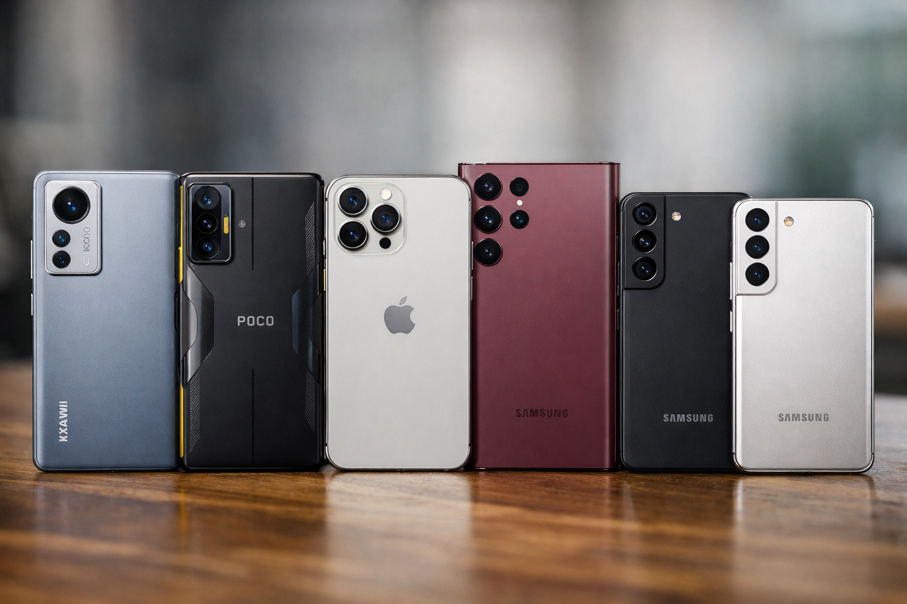
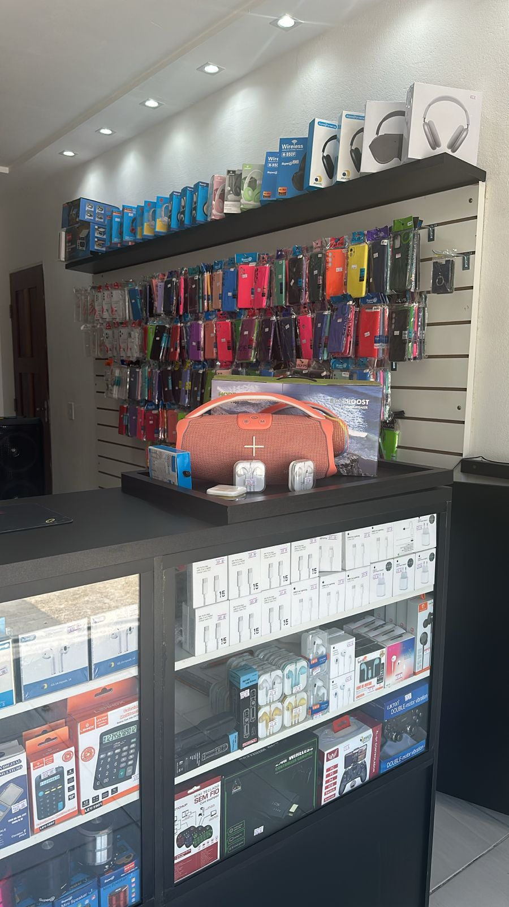
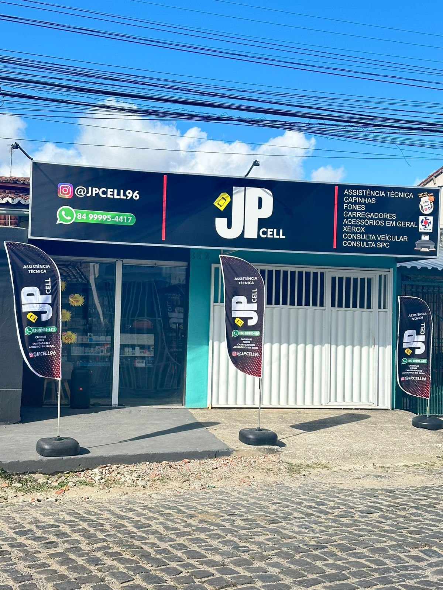

<!DOCTYPE html>
<html lang="pt-BR">

<head>
    <meta charset="UTF-8">
    <meta name="viewport" content="width=device-width, initial-scale=1.0, maximum-scale=1.0, user-scalable=no">
    <meta name="description"
        content="JP Cell - Venda de celulares, acessórios e assistência técnica especializada. Seu celular novo ou consertado com quem entende.">
    <title>JP Cell - Assistência Técnica e Smartshop</title>

    <!-- Google Fonts: Poppins -->
    <link rel="preconnect" href="https://fonts.googleapis.com">
    <link rel="preconnect" href="https://fonts.gstatic.com" crossorigin>
    <link href="https://fonts.googleapis.com/css2?family=Poppins:wght@300;400;500;600;700;800&display=swap"
        rel="stylesheet">

    <!-- Font Awesome Icons -->
    <link rel="stylesheet" href="https://cdnjs.cloudflare.com/ajax/libs/font-awesome/6.4.0/css/all.min.css">

    
</head>

<body>

    <!-- Header -->
    <header id="header">
        <a href="#" class="logo">
            <i class="fa-solid fa-mobile-screen-button"></i> JPCell
        </a>

        

            <i class="fa-solid fa-bars"></i>
        

        

        <nav id="nav-menu">
            <ul>
                <li><a href="#inicio" class="nav-link">Início</a></li>
                <li><a href="#servicos" class="nav-link">Serviços</a></li>
                <li><a href="#produtos" class="nav-link">Produtos</a></li>
                <li><a href="#contato" class="nav-link">Contato</a></li>
                <li>
                    <a href="https://wa.me/558499954417" target="_blank" class="btn btn-whatsapp btn-whatsapp-nav">
                        <i class="fa-brands fa-whatsapp"></i> WhatsApp
                    </a>
                </li>
            </ul>
        </nav>
    </header>

    <!-- Hero Section -->
    <section id="inicio" class="hero">
        

            <h1>Seu celular novo ou consertado com quem entende.</h1>
            
Venda de celulares, acessórios e assistência técnica especializada. Referência em qualidade e confiança.
            

            

                <a href="#contato" class="btn btn-primary">
                    <i class="fa-solid fa-clipboard-list"></i> Fazer Orçamento
                </a>
                <a href="https://wa.me/558499954417" target="_blank" class="btn btn-outline">
                    <i class="fa-brands fa-whatsapp"></i> Falar no WhatsApp
                </a>
            

        

    </section>

    <!-- Services Section -->
    <section id="servicos" class="section services">
        <h2 class="section-title reveal">Nossos Serviços</h2>

        

            <!-- Service 1 -->
            

                

                    <i class="fa-solid fa-screwdriver-wrench"></i>
                

                <h3>Assistência Técnica</h3>
                
Troca de tela, bateria, conectores, banho químico e reparos avançados em placas para todas as marcas.
                

            

            <!-- Service 2 -->
            

                

                    <i class="fa-solid fa-mobile-screen"></i>
                

                <h3>Venda de Celulares</h3>
                
Smartphones novos e seminovos das melhores marcas com garantia, procedência e os melhores preços.

            

            <!-- Service 3 -->
            

                

                    <i class="fa-solid fa-headphones-simple"></i>
                

                <h3>Acessórios</h3>
                
Capinhas, películas 3D/Privacidade, carregadores turbo, cabos originais, fones bluetooth e muito
                    mais.

            

        

    </section>

    <!-- Differentials Section -->
    <section class="differentials">
        

            

                <i class="fa-solid fa-bolt icon"></i>
                <h4>Reparo Rápido</h4>
                
Consertos ágeis para você não ficar desconectado. A maioria dos reparos é levada a termo no mesmo
                    dia.

            

            

                <i class="fa-solid fa-user-gear icon"></i>
                <h4>Técnicos Especializados</h4>
                
Profissionais capacitados e em constante atualização para diagnosticar e resolver problemas com
                    precisão.

            

            

                <i class="fa-solid fa-shield-halved icon"></i>
                <h4>Garantia no Serviço</h4>
                
Todos os nossos reparos contam com garantia assegurada, para oferecer a você a máxima tranquilidade.
                

            

            

                <i class="fa-solid fa-microchip icon"></i>
                <h4>Peças de Qualidade</h4>
                
Utilizamos apenas componentes originais ou de primeira linha, visando o máximo desempenho do seu
                    aparelho.

            

        

    </section>

    <!-- Gallery / Products Section -->
    <section id="produtos" class="section">
        <h2 class="section-title reveal">Nossa Galeria</h2>

        

            <!-- Galeria 1: Celulares -->
            

                
                

                    <h3>Celulares</h3>
                

            

            <!-- Galeria 2: Acessórios -->
            

                
                

                    <h3>Acessórios</h3>
                

            

            <!-- Galeria 3: Assistência -->
            

                
                

                    <h3>Assistência Técnica</h3>
                

            

            <!-- Galeria 4: Loja -->
            

                
                

                    <h3>Nossa Loja</h3>
                

            

        

    </section>

    <!-- CTA Section -->
    <section class="cta reveal">
        

            <h2>Quebrou seu celular?</h2>
            
Traga seu aparelho para a JP Cell. Orçamento rápido, transparente e com a qualidade que seu smartphone
                merece.

            <a href="https://wa.me/558499954417" target="_blank" class="btn btn-whatsapp btn-large">
                <i class="fa-brands fa-whatsapp"></i> Solicitar Orçamento no WhatsApp
            </a>
        

    </section>

    <!-- Footer -->
    <footer id="contato">
        

            

                <a href="#" class="logo" style="margin-bottom: 20px;">
                    <i class="fa-solid fa-mobile-screen-button"></i> JPCell
                </a>
                
Especialistas em fazer seu celular voltar a ser novo. Venda, acessórios e assistência técnica de
                    confiança.

                

                    <a href="https://www.instagram.com/jp.cell96/" target="_blank" rel="noopener noreferrer"
                        aria-label="Instagram"><i class="fa-brands fa-instagram"></i></a>
                    <a href="#" aria-label="Facebook"><i class="fa-brands fa-facebook-f"></i></a>
                    <a href="https://wa.me/558499954417" target="_blank" rel="noopener noreferrer"
                        aria-label="WhatsApp"><i class="fa-brands fa-whatsapp"></i></a>
                

            

            

                <h3>Links Rápidos</h3>
                <ul>
                    <li><a href="#inicio">Início</a></li>
                    <li><a href="#servicos">Nossos Serviços</a></li>
                    <li><a href="#produtos">Produtos e Galeria</a></li>
                    <li><a href="#contato">Fale Conosco</a></li>
                </ul>
            

            

                <h3>Contato</h3>
                <ul class="contact-info">
                    <li><i class="fa-solid fa-location-dot"></i> Av. Brg. Trompowsky, 992 - Monte Castelo, Parnamirim -
                        RN, 59146-260</li>
                    <li><i class="fa-brands fa-whatsapp"></i> (84) 99995-4417</li>
                    <li><i class="fa-solid fa-envelope"></i> jpcellparnamirim@gmail.com</li>
                    <li><i class="fa-solid fa-clock"></i> Seg a Sex: 08h às 18h | Sáb: 08h às 12h</li>
                </ul>
            

        

        

            
<strong>&copy; 2026 JP Cell &mdash; Todos os direitos reservados</strong>

        

    </footer>

    <!-- Floating Buttons -->
    

        <a href="https://www.instagram.com/jp.cell96/" target="_blank" rel="noopener noreferrer"
            class="btn-floating btn-instagram" aria-label="Instagram">
            <i class="fa-brands fa-instagram"></i>
        </a>
        <a href="https://www.google.com/maps/place/JP+Cell+Monte+Castelo+-+Assist%C3%AAncia+T%C3%A9cnica+e+Acess%C3%B3rios/@-5.9071394,-35.2692043,21z/data=!4m15!1m8!3m7!1s0x7b25702a8611195:0x2fa03df4a944d209!2sAv.+Brg.+Trompowsky,+992+-+Monte+Castelo,+Parnamirim+-+RN,+59146-260!3b1!8m2!3d-5.9070764!4d-35.2691771!16s%2Fg%2F11fy9zgqsp!3m5!1s0x7b257565b3500db:0x52ceee38cfaf8eba!8m2!3d-5.9070764!4d-35.2691771!16s%2Fg%2F11wr6ns09_?hl=pt-BR&entry=ttu&g_ep=EgoyMDI2MDMxMS4wIKXMDSoASAFQAw%3D%3D"
            target="_blank" rel="noopener noreferrer" class="btn-floating btn-location" aria-label="Localização">
            <i class="fa-solid fa-location-dot"></i>
        </a>
    

    <!-- Scripts -->
    
</body>

</html>
